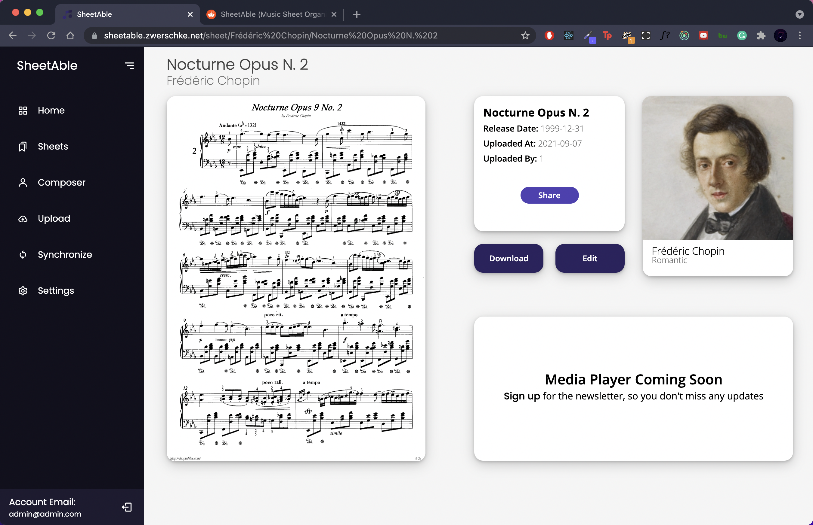

<!-- PROJECT LOGO -->
 

  

  <h3 align="center">SheetAble</h3>

  

    Self-hosted music sheet organizing software
     
    <a href="https://sheetable.net" target="_blank"><strong>Explore the docs »</strong></a>
     
     
    <a href="https://discord.com/invite/QnFbxyPbRj" target="_blank">Discord Server</a>
    ·
    <a href="https://github.com/SheetAble/SheetAble/issues">Report Bug</a>
    ·
    <a href="https://github.com/othneildrew/Best-README-Template/issues">Request Feature</a>
  

<!-- TABLE OF CONTENTS -->

  
Table of Contents

  <ol>
    <li>
      <a href="#about-the-project">About The Project</a>
      <ul>
        <li><a href="#built-with">Built With</a></li>
      </ul>
    </li>
    <li>
		<a href="#getting-started">Getting Started</a>
    </li>
    <li><a href="#roadmap">Roadmap</a></li>
    <li><a href="#contributing">Contributing</a></li>
    <li><a href="#license">License</a></li>
    <li><a href="#contact">Contact</a></li>
    <li><a href="#acknowledgements">Acknowledgements</a></li>
  </ol>

<!-- ABOUT THE PROJECT -->
## About The Project

**SheetAble** is an easy to use music sheet organiser for all the music enthusiasts out there. Currently the only client is on the web, but the goal was from the beginning on to have SheetAble available on all devices with the functionality to make notes onto your pdfs and have them stored on your home server. It is still consultation if there should be a Desktop app ontop of the Website as a further client. If you'd like to share your opion on that topic or many more go ahead and join our [Discord Server](https://discord.gg/QnFbxyPbRj).

### Built With

The backend is written with [Golang](https://golang.org/) and the Frontend with [React.js](https://reactjs.org/).

<!-- GETTING STARTED -->
## Getting Started
To get started please refer to the official [SheetAble Documentation](https://sheetable.net/).
<!-- ROADMAP -->
## Roadmap

See the [open issues](https://github.com/SheetAble/SheetAble/issues) for a list of proposed features (and known issues).

<!-- CONTRIBUTING -->
## Contributing

Contributions are what make the open source community such an amazing place to learn, inspire, and create. Any contributions you make are **greatly appreciated**.

1. Fork the Project
2. Create your Feature Branch (`git checkout -b feature/AmazingFeature`)
3. Commit your Changes (`git commit -m 'Add some AmazingFeature'`)
4. Push to the Branch (`git push origin feature/AmazingFeature`)
5. Open a [Pull Request](https://github.com/SheetAble/SheetAble/compare)

<!-- LICENSE -->
## License

Distributed under the AGPL License. See `LICENSE` for more information.

<!-- CONTACT -->
## Contact

Valentin Zwerschke - [@vallezw](https://github.com/vallezw)

Organization Link: [github.com/SheetAble](https://github.com/SheetAble)

<!-- ACKNOWLEDGEMENTS -->
## Acknowledgements
* [Open Opus API](https://www.webpagefx.com/tools/emoji-cheat-sheet) - Free, open metadata for classical music
