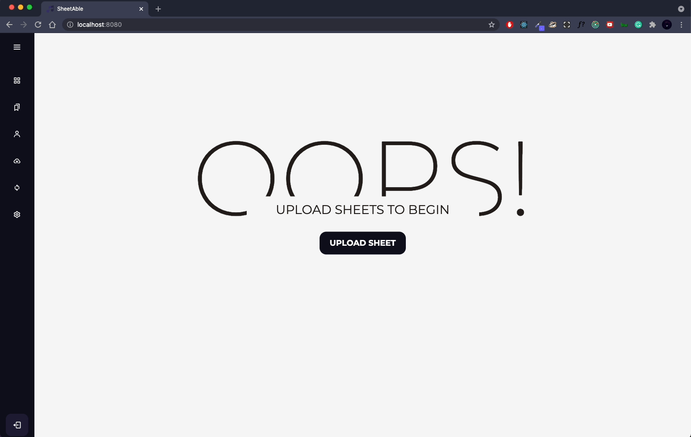

<p align="center">
   <a href="./LICENSE">  </a>
<a href="https://discord.com/invite/QnFbxyPbRj">  </a>
</p>
<br />
<p align="center">
  <a href="https://github.com/SheetAble">
    
  </a>

  <h3 align="center">SheetAble</h3>

  <p align="center">
    Self-hosted music sheet organizing software
    <br />
    <a href="https://sheetable.net" target="_blank"><strong>Explore the docs »</strong></a>
    <br />
    <br />
    <a href="https://discord.com/invite/QnFbxyPbRj" target="_blank">Discord Server</a>
    ·
    <a href="https://github.com/SheetAble/SheetAble/issues">Report Bug</a>
    ·
    <a href="https://github.com/SheetAble/SheetAble/issues">Request Feature</a>
  </p>
</p>

<!-- TABLE OF CONTENTS -->
<details open="open">
  <summary>Table of Contents</summary>
  <ol>
    <li>
      <a href="#about-the-project">About The Project</a>
      <ul>
        <li><a href="#built-with">Built With</a></li>
      </ul>
    </li>
    <li>
		<a href="#getting-started">Getting Started</a>
      <ul>
        <li><a href="#cloning-the-repo">Cloning the Repo</a></li>
      </ul>
      <ul>
        <li><a href="#production-version">Production Version</a></li>
      </ul>
      <ul>
        <li><a href="#development-version">Development Version</a></li>
      </ul>
    </li>
    <li><a href="#project-structure">Project Structure</a></li>
    <ul>
      <li><a href="#frontend-project-structure">Frontend Project Structure</a></li>
      <li><a href="#backend-project-structure">Backend Project Structure</a></li>
    </ul>
    <li><a href="#roadmap">Roadmap</a></li>
    <li><a href="#contributing">Contributing</a></li>
    <li><a href="#license">License</a></li>
    <li><a href="#contact">Contact</a></li>
    <li><a href="#acknowledgements">Acknowledgements</a></li>
    <li><a href="#supporters">Supporters</a></li>
  </ol>
</details>

<!-- ABOUT THE PROJECT -->

## About The Project



**SheetAble** is an easy-to-use music sheet organizer for all the music enthusiasts out there. You can upload and organize your sheets for any kind of instrument you use!
Create Accounts for your friends or family to invite them to your library to use it as well or potentially upload sheets themselves.
Currently it is available for web and [iPad/Android Tablets](https://github.com/SheetAble/tablet-client). All repos are open-source with the `AGPL` license.

You may also suggest changes by forking this repo and creating a [pull request](https://github.com/SheetAble/SheetAble/compare) or opening an [issue](https://github.com/SheetAble/SheetAble/issues). Thanks to all the people who want to help expanding this project!

### Built With

The backend is written in [Golang](https://golang.org/) and the frontend with [React.js](https://reactjs.org/).

<!-- GETTING STARTED -->

## Getting Started

### Project Setup
The first step to contributing to this project is cloning the project to your local machine. To do this, open terminal and `cd` into the directory on your computer where you'd like this project to live. Then, run:

```git clone https://github.com/SheetAble/SheetAble.git```

Next, take a look at the guides, which walk through steps to install dependencies for the project. 
### Production Version

To install the **production** version of SheetAble please refer to this [Docs page](https://sheetable.net/docs/Installation/installation).

### Development Version

To develop on SheetAble we also made a [Documentation guide](https://sheetable.net/docs/development).

<!-- PROJECT STRUCTURE -->

## Project Structure

### Frontend Project Structure
To get started on making changes to the user interface, you'll want to take a look at the `frontend/src` directory. Here, you'll find the `Components` folder, which contains React components and css styling files associated with different functionality of the website. For example, within the `Authentication` directory, you can find all files related to user sign in/signup, and password reset. Likewise, `SheetsPage` contains code associated with sheets of music for a piece. Below is the basic structure of the frontend directory, displaying important folders and files.
```bash
src
    ├── App.css
    ├── App.js
    ├── Components
    │   ├── Authentication
    │   ├── Composer
    │   ├── Composers
    │   ├── ComposersPage
    │   ├── Home
    │   ├── NotFound
    │   ├── Ping
    │   ├── Redirect
    │   ├── SearchPage
    │   ├── SettingsPage
    │   │   └── Table
    │   │       ├── Buttons
    │   ├── Sheet
    │   │   ├── Components
    │   ├── Sheets
    │   ├── SheetsPage
    │   │   ├── Components
    │   ├── Sidebar
    │   ├── TagsPage
    │   └── Upload
``````

### Backend Project Structure
The files concerning the backend of the project are placed in the `backend` directory. Below is the basic structure of the backend of the project.
```bash
backend
├── Dockerfile
├── Makefile
├── api
│   ├── auth
│   │   └── token.go
│   ├── config
│   │   ├── config.go
│   │   ├── config_test.go
│   │   └── constants.go
│   ├── controllers
│   │   ├── base.go
│   │   ├── composers_controller.go
│   │   ├── home_controller.go
│   │   ├── login_controller.go
│   │   ├── rice-box.go
│   │   ├── routes.go
│   │   ├── search_controller.go
│   │   ├── sheet_controller.go
│   │   ├── uploader.go
│   │   └── users_controller.go
│   ├── forms
│   │   ├── common.go
│   │   ├── composers.go
│   │   ├── information_text.go
│   │   ├── sheets.go
│   │   ├── tags.go
│   │   ├── upload.go
│   │   └── user.go
│   ├── middlewares
│   │   └── auth.go
│   ├── models
│   │   ├── Composer.go
│   │   ├── Pagination.go
│   │   ├── Sheet.go
│   │   └── User.go
│   ├── seed
│   │   └── seeder.go
│   ├── server.go
│   └── utils
│       ├── formaterror
│       │   └── formaterror.go
│       ├── goUtils.go
│       ├── http.go
│       ├── osFunctions.go
│       ├── osFunctions_test.go
│       ├── pdfToImage.go
│       ├── smtpFunctions.go
│       └── version.go
├── build.sh
├── go.mod
├── go.sum
└── main.go
``````

Below is a summary/description of some of the important directories within the project and what each contain:

`auth`: handles generating and validating tokens for user authentication 

`controllers`: define backend endpoints for user requests, with each file pertaining to specific functionality such as `login`, or `composers`

`forms`: files to handle incoming requests related to various inputs (such as `Composer`, `Sheet`, `User`)

`utils`: defines reusable utilities/functionality that can be reused throughout application, such as `pdfToImage.go`, which contains code to obtain a png file from a pdf.

`models`: Contains files outlining structure of data to represent `Composer`, `Pagination`, `Sheet`, and `User` entities

<!-- ROADMAP -->

## Roadmap

See the [open issues](https://github.com/SheetAble/SheetAble/issues) for a list of proposed features (and known issues).

<!-- CONTRIBUTING -->

## Contributing

Contributions are what make the open-source community such an amazing place to learn, inspire, and create. Any contributions you make are **greatly appreciated**.

1. Fork the Project
2. Create your Feature Branch (`git checkout -b feature/AmazingFeature`)
3. Commit your Changes (`git commit -m 'Add some AmazingFeature'`)
4. Push to the Branch (`git push origin feature/AmazingFeature`)
5. Open a [Pull Request](https://github.com/SheetAble/SheetAble/compare) using the [PR Template](https://github.com/SheetAble/SheetAble/blob/main/pull_request_template.md)

<!-- LICENSE -->

## License

Distributed under the AGPL License. See `LICENSE` for more information.

<!-- CONTACT -->

## Contact

Valentin Zwerschke - [@vallezw](https://github.com/vallezw)

Organization Link: [github.com/SheetAble](https://github.com/SheetAble)

<!-- ACKNOWLEDGEMENTS -->

## Acknowledgements

- [Open Opus API](https://openopus.org) - Free, open metadata for classical music
